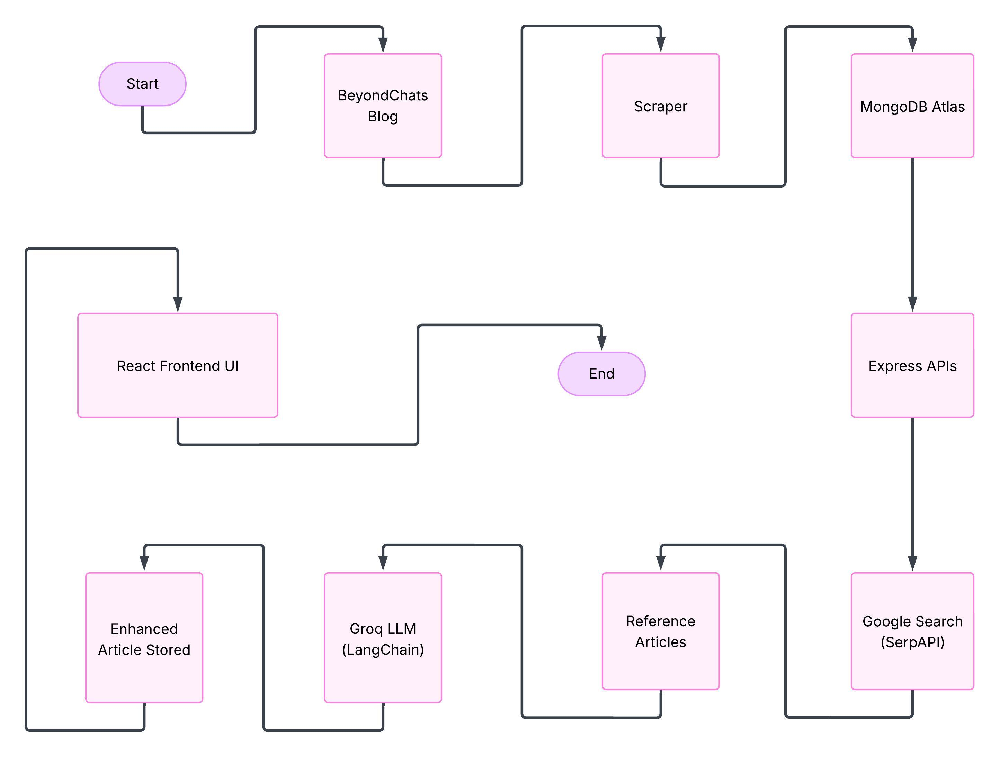

# BeyondChats Assignment — Full Stack Article Enhancement System

A full‑stack web application built for the BeyondChats assignment that scrapes blog articles, stores them in MongoDB, enhances them using an LLM (Groq via LangChain), and displays both original and AI‑enhanced versions in a responsive React UI.


---

## Project Overview

This application:
- Scrapes blog articles (BeyondChats)
- Stores raw articles in MongoDB Atlas
- Uses Google search (SerpAPI) to find reference articles
- Uses Groq LLM via LangChain to rewrite / enhance the original article using the top references
- Stores the AI‑updated content and displays both original and enhanced versions side‑by‑side in a React frontend

---

## Tech Stack

Backend
- Node.js
- Express.js
- MongoDB Atlas (Mongoose)
- Axios
- Cheerio (web scraping)
- LangChain
- Groq LLM API
- SerpAPI (Google Search)

Frontend
- React (Vite)
- Tailwind CSS
- Axios

---


## Local Setup

### Prerequisites
- Node.js (v16+ recommended)
- npm or yarn
- MongoDB Atlas account (or local MongoDB)
- Groq API key
- SerpAPI key
- (Optional) ngrok or other tunneling for external callbacks

### 1. Clone the repository
```bash
git clone https://github.com/your-username/beyondchats-assignment.git
cd beyondchats-assignment
```

### 2. Backend Setup
Install dependencies:
```bash
npm install
```

Create a `.env` file in the repository root with the following variables:
```env
MONGO_URI=your_mongodb_atlas_uri
GROQ_API_KEY=your_groq_api_key
SERPAPI_API_KEY=your_serpapi_key
CLIENT_URL=http://localhost:5173
PORT=5000
```

Start the backend:
```bash
node server.js
```

By default the backend runs at:
http://localhost:5000

### 3. Frontend Setup
Open a new terminal and run:
```bash
cd frontend
npm install
```

Create `frontend/.env`:
```env
VITE_API_BASE_URL=http://localhost:5000/api
```

Start the frontend:
```bash
npm run dev
```

Frontend default:
http://localhost:5173

---

## Environment Variables

Root `.env` (backend)
- MONGO_URI — MongoDB connection string (Atlas or local)
- GROQ_API_KEY — Groq LLM API key used by LangChain
- SERPAPI_API_KEY — SerpAPI key for Google search
- CLIENT_URL — Frontend origin (e.g., http://localhost:5173)
- PORT — Backend port (default: 5000)

Frontend `.env`
- VITE_API_BASE_URL — Base URL for API calls from the frontend (e.g., http://localhost:5000/api)

---

## Run (Development)

1. Start backend:
```bash
cd backend
npm run dev
```

2. Start frontend:
```bash
cd frontend
npm run dev
```


---

## API Endpoints

| Method | Endpoint | Description |
|------|---------|-------------|
| GET | `/api/articles` | Fetch all articles |
| GET | `/api/articles/:id` | Fetch a single article by ID |
| POST | `/api/articles` | Create a new article |
| PUT | `/api/articles/:id` | Update an existing article |
| DELETE | `/api/articles/:id` | Delete an article |
| POST | `/api/articles/:id/enhance` | Enhance a specific article by performing Google search, fetching reference articles, calling the LLM, and storing the updated content |

---

## Data Flow Diagram


---

## Live Links

- Frontend (Live): [https://aiblog-delta.vercel.app/](https://aiblog-delta.vercel.app/)
- Backend API: [https://aiblog-z4pu.onrender.com](https://aiblog-z4pu.onrender.com)

Replace the above URLs with your deployed links.

---

## Author

Rajat Ranvir  
GitHub: [https://github.com/rajat3154](https://github.com/rajat3154)

---


